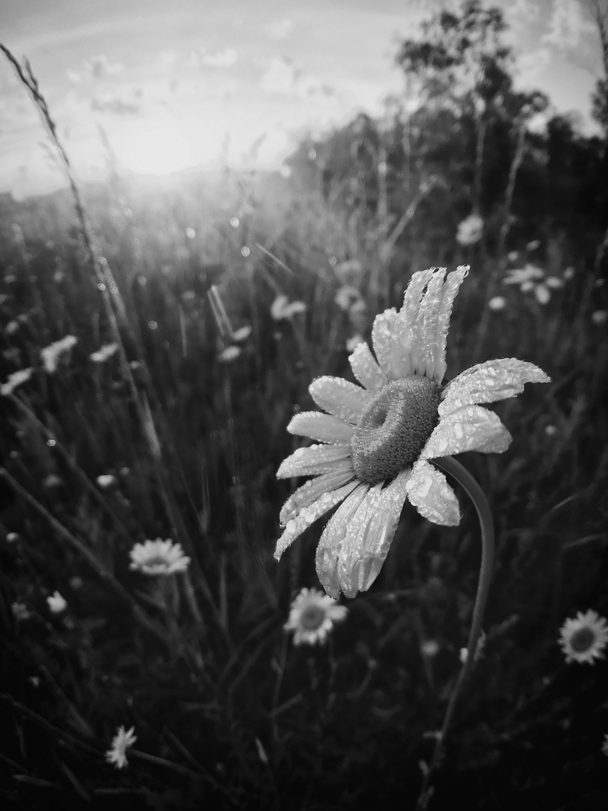
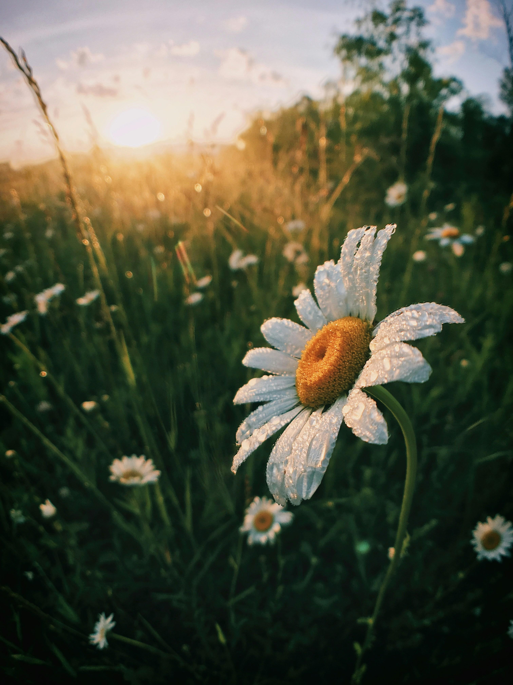
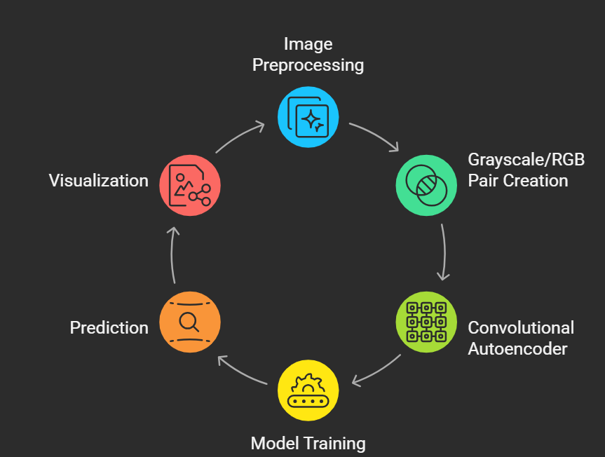

#  AI-Based Photo Colorization using Convolutional Autoencoders

An advanced Deep Learning and Computer Vision project that automatically converts grayscale landscape images into realistic RGB colorized images using Convolutional Autoencoders built with TensorFlow, OpenCV, and Keras.

##  Overview

This project implements an AI-powered image colorization system using a Convolutional Autoencoder architecture.

The model learns how to reconstruct RGB color channels from grayscale landscape images by training on paired grayscale and color datasets.

The complete workflow includes:

- Dataset preprocessing
- Grayscale and RGB image pairing
- Image normalization and resizing
- Encoder-decoder based feature learning
- Deep learning model training
- Prediction on unseen grayscale images
- Visualization of generated colorized outputs

The project demonstrates practical applications of:

- Deep Learning
- Computer Vision
- Image Reconstruction
- Convolutional Neural Networks (CNNs)
- Autoencoders using TensorFlow/Keras

##  Demo Results

The trained Convolutional Autoencoder successfully predicts realistic RGB outputs from grayscale landscape images.

### Grayscale to Colorized Transformation

<table align="center">
<tr>
<td align="center">

</td>

<td align="center" width="80">
<h1>➡️</h1>
</td>

<td align="center">

</td>
</tr>

<tr>
<td align="center"><b>Grayscale Input</b></td>
<td></td>
<td align="center"><b>Colorized Output</b></td>
</tr>
</table>

#### Result Explanation

- Left Image → Original grayscale landscape image
- Right Image → AI-generated colorized output

The model learns textures, spatial structures, and semantic color patterns during training to reconstruct realistic RGB outputs from grayscale inputs.

The system is trained using grayscale input images and corresponding RGB target images to learn semantic color representations automatically.

 ## 🔄 Workflow Diagram

The project follows a complete Deep Learning-based image colorization workflow.

  

### Workflow Steps

1. Collect grayscale and RGB landscape image datasets
2. Resize all images to 120×120 dimensions
3. Normalize pixel values between 0 and 1
4. Create paired grayscale-RGB datasets
5. Train the Convolutional Autoencoder
6. Generate predictions on unseen grayscale images
7. Visualize generated RGB outputs
